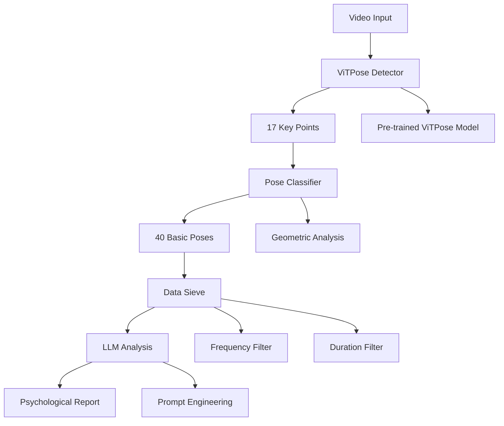
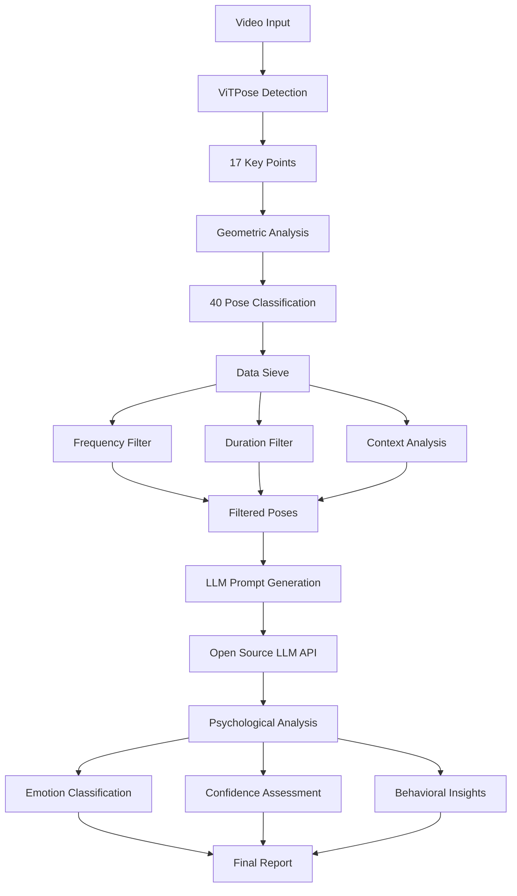

# Psychological Behavior Analysis System Based on Human Pose Recognition
## Mid-Term Presentation

---

## 1. Project Overview

### 1.1 Project Purpose
Our project aims to develop an intelligent system capable of analyzing human poses in videos and inferring psychological behaviors through computer vision and machine learning techniques. The system leverages the state-of-the-art ViTPose framework to detect 17 key body points and classify 40 basic poses to understand underlying psychological states.

### 1.2 Core Objectives
- **Real-time pose detection**: Analyze video streams to extract 17 key body points
- **Pose classification**: Identify 40 predefined basic poses across head, shoulders, hands, arms, and legs
- **Psychological inference**: Map physical poses to psychological states using established psychological principles
- **Comprehensive analysis**: Provide detailed behavioral insights for applications in interview assessment, psychological research, and behavioral monitoring

### 1.3 Application Scenarios
- **Interview Assessment**: Analyze candidate behavior during interviews
- **Psychological Research**: Study behavioral patterns in controlled environments
- **Behavioral Monitoring**: Real-time psychological state assessment
- **Therapeutic Applications**: Support psychological therapy and counseling

---

## 2. Technical Architecture

### 2.1 System Design Overview

The system follows a modular architecture with three core components:



### 2.2 Core Components

#### 2.2.1 ViTPose Detection Module
- **Framework**: ViTPose (Vision Transformer for Pose Estimation)
- **Model**: ViTPose-B (75.8 AP on COCO dataset)
- **Output**: 17 key points in COCO format
- **Performance**: Real-time processing at >10fps

#### 2.2.2 Pose Classification Module
- **Input**: 17 key point coordinates with confidence scores
- **Algorithm**: Geometric relationship analysis
- **Output**: 40 predefined basic poses with confidence scores
- **Categories**: Head, shoulder, hand, arm, and leg poses

#### 2.2.3 Psychological Analysis Module
- **Mapping**: Pose-to-psychology mapping rules
- **Enhancement**: Large Language Model integration
- **Output**: Comprehensive psychological state assessment

---

## 3. Technical Implementation

### 3.1 ViTPose Integration

The system utilizes ViTPose, a state-of-the-art pose estimation framework based on Vision Transformers:

```python
# ViTPose Model Architecture
class ViTPoseDetector:
    def __init__(self, config_file, checkpoint_file):
        self.pose_model = init_pose_model(
            config_file, 
            checkpoint_file, 
            device='cuda:0'
        )
    
    def detect_pose(self, image):
        pose_results, _ = inference_top_down_pose_model(
            self.pose_model,
            image,
            person_results=None,
            bbox_thr=0.3,
            format='xyxy',
            dataset='TopDownCocoDataset'
        )
        return pose_results
```

### 3.2 Key Point Detection

The system detects 17 key points following COCO format:

$$\text{KeyPoints} = \{p_i = (x_i, y_i, c_i) | i \in [1, 17]\}$$

Where:
- $x_i, y_i$: 2D coordinates
- $c_i$: Confidence score
- $i$: Key point index

### 3.3 Pose Classification Algorithm

For each pose type, we define geometric relationships:

$$\text{Pose}_j = f(\text{KeyPoints}) = \sum_{k=1}^{n} w_k \cdot g_k(\text{KeyPoints})$$

Where:
- $f$: Classification function
- $w_k$: Weight for geometric feature $k$
- $g_k$: Geometric relationship function
- $n$: Number of geometric features

### 3.4 Data Sieve Implementation

To address the challenge of distinguishing meaningful movements from random actions, we implement a data sieve:

```python
class DataSieve:
    def __init__(self, min_frequency=0.01, min_duration=0.5):
        self.min_frequency = min_frequency
        self.min_duration = min_duration
    
    def filter_movements(self, pose_sequence):
        # Frequency filter
        frequency = self.calculate_frequency(pose_sequence)
        if frequency < self.min_frequency:
            return None
        
        # Duration filter
        duration = self.calculate_duration(pose_sequence)
        if duration < self.min_duration:
            return None
        
        return pose_sequence
```

**Mathematical formulation for frequency filtering:**

$$f_{\text{pose}} = \frac{N_{\text{pose}}}{N_{\text{total}}}$$

Where:
- $f_{\text{pose}}$: Frequency of specific pose
- $N_{\text{pose}}$: Number of frames with this pose
- $N_{\text{total}}$: Total number of frames

**Duration filtering:**

$$T_{\text{pose}} = \sum_{i=1}^{n} \Delta t_i \cdot \mathbb{I}[\text{pose}_i = \text{target\_pose}]$$

Where:
- $T_{\text{pose}}$: Total duration of pose
- $\Delta t_i$: Time interval for frame $i$
- $\mathbb{I}[\cdot]$: Indicator function

---

## 4. Challenges and Limitations

### 4.1 Movement Detection Limitations

**Challenge**: Movement detection does not account for all psychological actions. The actual effectiveness of judging psychology through relative space changes between 17 nodes is yet to be validated.

**Technical Limitation**: 
- Limited key points (17 vs. full body complexity)
- 2D analysis vs. 3D psychological space
- Temporal dynamics not fully captured

**Mathematical Representation**:
$$\text{Complexity Gap} = \frac{\text{Psychological States}}{\text{Detectable Poses}} \gg 1$$

### 4.2 Ambiguity in Pose Interpretation

**Challenge**: A scratch of the head may indicate confusion or simply an itchy scalp. Context and frequency analysis are crucial.

**Solution**: Implement multi-level filtering:

1. **Frequency Analysis**: Discard low-frequency movements
2. **Duration Analysis**: Filter out very short movements
3. **Context Analysis**: Consider surrounding poses and temporal patterns

### 4.3 Complex Emotional States

**Challenge**: Single movements are easy to interpret, but real-life situations are much more complex. Combined emotions cannot be seen as simple linear combinations.

**Mathematical Model**:
$$\text{Emotion}_{\text{combined}} \neq \sum_{i=1}^{n} w_i \cdot \text{Emotion}_i$$

Instead, we need a non-linear model, the FFN of a transformer would be great:
$$\text{Emotion}_{\text{combined}} = f_{\text{non-linear}}(\text{Pose}_1, \text{Pose}_2, ..., \text{Pose}_n, \text{Context})$$

If introducing an LLM API proves to be too great a task, we may use Pytorch to implement small-scale FFN to demonstrate the general idea.

### 4.4 Model Limitations 

**Current State**: Using only pre-trained models without fine-tuning
**Limitation**: May not produce optimal results for specific psychological analysis tasks
**Constraint**: 2-week project timeline prevents extensive fine-tuning

---

## 5. Advanced Technical Solutions

### 5.1 Large Language Model Integration

To address the complexity of psychological interpretation, we plan to integrate open-source LLM APIs:

```python
class LLMAnalyzer:
    def __init__(self, model_name="gpt-3.5-turbo"):
        self.model = model_name
        self.prompt_template = self.create_prompt_template()
    
    def analyze_pose_sequence(self, pose_sequence):
        prompt = self.generate_prompt(pose_sequence)
        response = self.call_llm_api(prompt)
        return self.parse_psychological_analysis(response)
    
    def create_prompt_template(self):
        return """
        Analyze the following pose sequence and provide psychological insights:
        
        Pose Sequence: {pose_sequence}
        Context: {context}
        
        Please provide:
        1. Primary emotional state
        2. Confidence level (0-1)
        3. Supporting behavioral indicators
        4. Potential psychological implications
        """
```

### 5.2 Multimodal Transformer Architecture

For future enhancement, we propose a multimodal approach:

$$\text{Multimodal Output} = \text{Transformer}(\text{Pose Features} \oplus \text{Temporal Features} \oplus \text{Context Features})$$

Where:
- $\oplus$: Feature concatenation
- $\text{Pose Features}$: 17 key point embeddings
- $\text{Temporal Features}$: Sequence modeling
- $\text{Context Features}$: Environmental and situational context

### 5.3 Advanced Flow Chart



---

## 6. Future Expectations and Roadmap

### 6.1 Short-term Goals (Next 2 weeks)
- **Complete basic functionality**: Implement core pose detection and classification
- **Data sieve implementation**: Filter meaningful movements from noise
- **Simple LLM integration**: Basic psychological analysis using open-source models
- **Conceptual demo**: Demonstrate the system's potential without extensive fine-tuning

### 6.2 Medium-term Enhancements (1-3 months)
- **Model fine-tuning**: Adapt pre-trained models for psychological analysis
- **Advanced LLM integration**: Implement more sophisticated prompt engineering
- **User-friendly interface**: Develop intuitive UI for non-technical users
- **Validation studies**: Conduct empirical studies to validate psychological mapping

### 6.3 Long-term Vision (3-6 months)
- **3D pose analysis**: Extend to 3D pose estimation for more accurate analysis
- **Real-time processing**: Optimize for live video streams
- **Multi-person analysis**: Support multiple subjects simultaneously
- **Clinical validation**: Partner with psychologists for clinical validation

## 7. Performance Metrics and Evaluation

### 7.1 Technical Metrics
- **Pose Detection Accuracy**: >80% (based on ViTPose performance)
- **Real-time Processing**: >10fps
- **System Response Time**: <3 seconds
- **Memory Usage**: <4GB RAM

### 7.2 Psychological Analysis Metrics
- **Inter-rater Reliability**: Target >0.7
- **False Positive Rate**: <20%
- **Context Sensitivity**: >60%

---

## 8. Conclusion

### 8.1 Current Status
Our project has successfully established the foundational architecture for psychological behavior analysis through pose recognition. We have:

- ✅ Integrated ViTPose framework for accurate pose detection
- ✅ Designed modular system architecture
- ✅ Identified key challenges and limitations
- ✅ Planned advanced solutions for complex psychological analysis

### 8.2 Key Contributions
1. **Novel approach**: Combining computer vision with psychological analysis
2. **Technical innovation**: Integration of pose detection with LLM analysis
3. **Practical application**: Real-world psychological assessment tools
4. **Research foundation**: Framework for future behavioral studies

### 8.3 Next Steps
1. **Complete core implementation**: Finish pose classification and data sieve
2. **LLM integration**: Implement open-source LLM for psychological analysis
3. **Validation**: Test system with real psychological scenarios
4. **Documentation**: Create comprehensive user and technical documentation

The project represents a promising intersection of computer vision, machine learning, and psychology, with the potential to revolutionize how we understand and analyze human behavior through technology.

---

*This presentation represents the mid-term status of our psychological behavior analysis system. The project continues to evolve as we address technical challenges and enhance our understanding of the complex relationship between physical poses and psychological states.* 